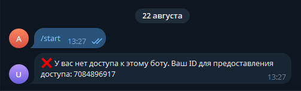
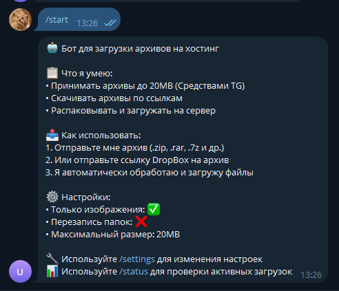
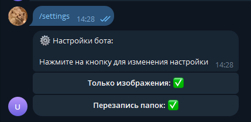
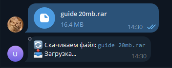
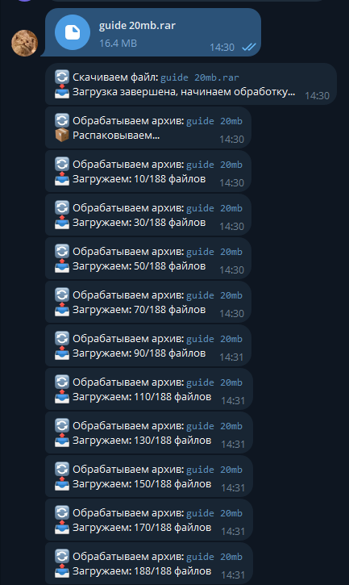
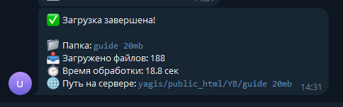
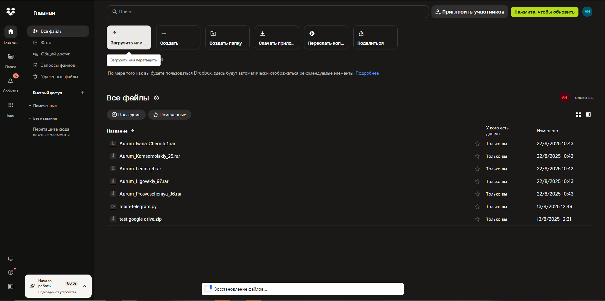
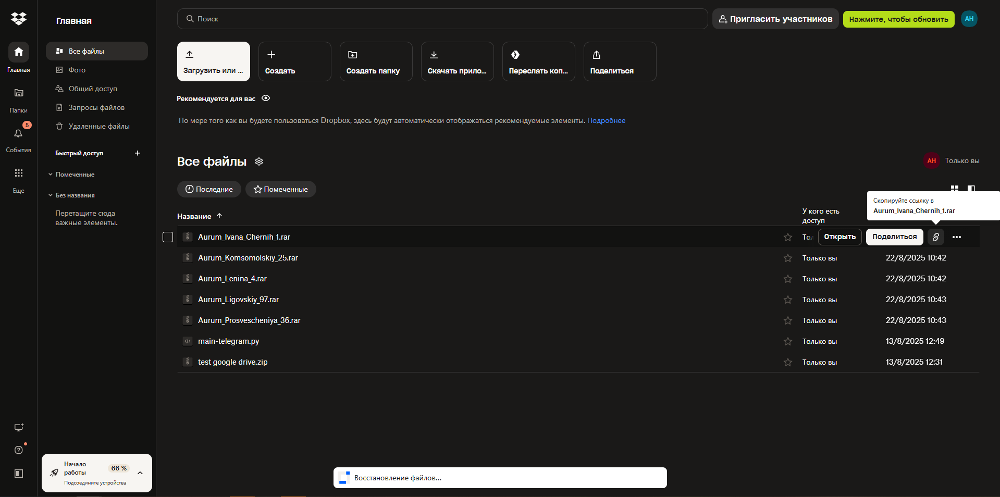
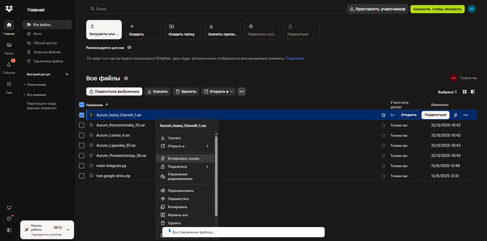
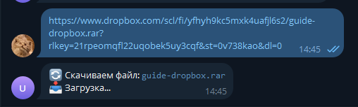

# Гайд по использованию Telegram бота для загрузки архивов

## 📋 Содержание
1. [Первый запуск и настройка доступа](#первый-запуск-и-настройка-доступа)
2. [Основные возможности бота](#основные-возможности-бота)
3. [Настройка бота](#настройка-бота)
4. [Загрузка архивов напрямую](#загрузка-архивов-напрямую)
5. [Работа с DropBox](#работа-с-dropbox)
6. [Troubleshooting](#troubleshooting)

---

## 🚀 Первый запуск и настройка доступа

### Шаг 1: Запуск бота
1. Найдите бота в Telegram по имени или токену
2. Нажмите кнопку **"Start"** или отправьте команду `/start`

### Шаг 2: Получение Telegram ID
При первом обращении к боту (если ваш ID не в списке разрешенных), бот покажет сообщение с отказом в доступе и отобразит ваш Telegram ID.



*Сообщение бота с отказом в доступе и отображением Telegram ID*

### Шаг 3: Предоставление доступа
1. Скопируйте ваш Telegram ID из сообщения бота
2. Отправьте Telefram ID в лс или группу, я предоставлю доступ к боту
3. После предоставления доступа перезапустите бота командой /start



*Успешное приветственное сообщение после предоставления доступа*

---

## 🔧 Основные возможности бота

Бот умеет:
- ✅ Принимать архивы до 20MB через Telegram
- ✅ Скачивать архивы любого веса по ссылкам DropBox
- ✅ Автоматически распаковывать архивы
- ✅ Загружать файлы на хостинг
- ✅ Фильтровать только изображения (опционально)
- ✅ Отслеживать прогресс загрузки

### Поддерживаемые форматы архивов:
- `.zip`
- `.rar`
- `.7z`
- `.tar`
- `.gz`
- `.bz2`
- `.xz`

### Поддерживаемые форматы изображений:
- `.jpg`, `.jpeg`
- `.png`
- `.gif`
- `.bmp`
- `.webp`
- `.tiff`, `.tif`
- `.svg`
- `.ico`

---

## ⚙️ Настройка бота

### Вызов меню настроек
Отправьте команду `/settings` для открытия меню настроек.



*Меню настроек бота с кнопками переключения*

### Доступные настройки:

#### 1. "Только изображения"
- **Включено (✅)**: Бот будет загружать только файлы изображений
- **Выключено (❌)**: Бот будет загружать все файлы из архива

#### 2. "Перезапись папок"
- **Включено (✅)**: Если папка уже существует на сервере, она будет перезаписана или дополнена новыми файлами
- **Выключено (❌)**: Если папка существует, данный архив будет пропущен

---

## 📤 Загрузка архивов менее 20МБ напрямую

### Шаг 1: Подготовка архива
1. Создайте архив с нужными файлами
2. Используйте поддерживаемые форматы (.zip, .rar и др.)

### Шаг 2: Отправка архива менее
1. В чате с ботом нажмите кнопку "📎" (скрепка)
2. Выберите **"Document"** или **"File"**
3. Найдите ваш архив и отправьте его



*Процесс выбора и отправки файла через Telegram*

### Шаг 3: Отслеживание процесса
Бот будет обновлять статус обработки:

1. **Скачивание**: `🔄 Скачиваем файл: guide 20mb.rar 📥 Загрузка...`
2. **Подключение**: `🔄 Обрабатываем архив: guide 20mb 📦 Подключаемся к серверу...`
3. **Распаковка**: `🔄 Обрабатываем архив: guide 20mb 📦 Распаковываем...`
4. **Загрузка**: `🔄 Обрабатываем архив: guide 20mb 📤 Загружаем файлы... (найдено: 188)`
5. **Прогресс**: `🔄 Обрабатываем архив: guide 20mb 📤 Загружаем: 10/188 файлов`



*Последовательность сообщений о статусе обработки*

### Шаг 4: Результат загрузки
После завершения бот покажет итоговую информацию:

```
✅ Загрузка завершена!

📁 Папка: guide 20mb
📤 Загружено файлов: 188
🚫 Пропущено не-изображений: 0
⏱️ Время обработки: 18.8 сек
🌐 Путь на сервере: yagis/public_html/YB/guide 20mb
```



---

## 📁 Работа с DropBox

Если ваш архив больше 20MB, используйте DropBox для загрузки.

### Шаг 1: Загрузка файла в DropBox

1. Откройте [dropbox.com](https://dropbox.com) в браузере
2. Войдите в свой аккаунт или создайте новый
3. Нажмите кнопку **"Upload"** или перетащите файл в окно браузера



*Интерфейс DropBox с кнопкой Upload*

4. Дождитесь завершения загрузки файла

### Шаг 2: Получение ссылки для скачивания

1. Найдите загруженный файл в списке
2. Наведите курсор на значок ссылки и нажмите эту кнопку



3. Ссылка автоматически скопируется в буфер обмена

### Шаг 3: Альтернативный способ - прямая ссылка

1. Нажмите правой кнопкой мыши на файл
2. Нажмите на **"Копировать ссылку"**



*Контекстное меню с опцией Скопировать ссылку*

### Шаг 4: Отправка ссылки боту

1. Вернитесь к чату с ботом в Telegram
2. Вставьте скопированную ссылку и отправьте её

Пример ссылки:
```
https://www.dropbox.com/scl/fi/4mxdqydh30dccpdqzij2z/Aurum_Ivana_Chernih_1.rar?rlkey=58zkbl8th40g7z1dl7p5lafi1&st=5ko6cum6&dl=0
```



*Отправка ссылки DropBox боту в Telegram*

---

## 🛠️ Troubleshooting

### Проблема: "❌ Файл слишком большой"
**Решение:**
1. Загрузите файл в DropBox
2. Отправьте ссылку боту вместо прямой загрузки

### Проблема: "❌ Неподдерживаемый формат архива"
**Решение:**
1. Убедитесь, что файл имеет расширение: .zip, .rar, .7z, .tar, .gz, .bz2, .xz
2. Если файл имеет правильное расширение, проверьте, что он не повреждён

### Проблема: "❌ Поддерживаются только ссылки Dropbox"
**Решение:**
Бот работает только со ссылками DropBox. Загрузите файл в DropBox и получите ссылку оттуда.

### Проблема: "⏳ У вас уже есть активная загрузка"
**Решение:**
Дождитесь завершения текущей загрузки. Используйте команду `/status` для проверки прогресса.

### Проблема: "⏭️ Папка уже существует на сервере"
**Решение:**
1. Включите опцию "Перезапись папок" в настройках (`/settings`)
2. Или переименуйте архив/папку для создания новой директории

---

## 📊 Дополнительная информация

### Ограничения:
- Максимальный размер файла через Telegram: **20MB**
- Одновременно может обрабатываться только **один архив** на пользователя
- Поддержка только **DropBox** для внешних ссылок